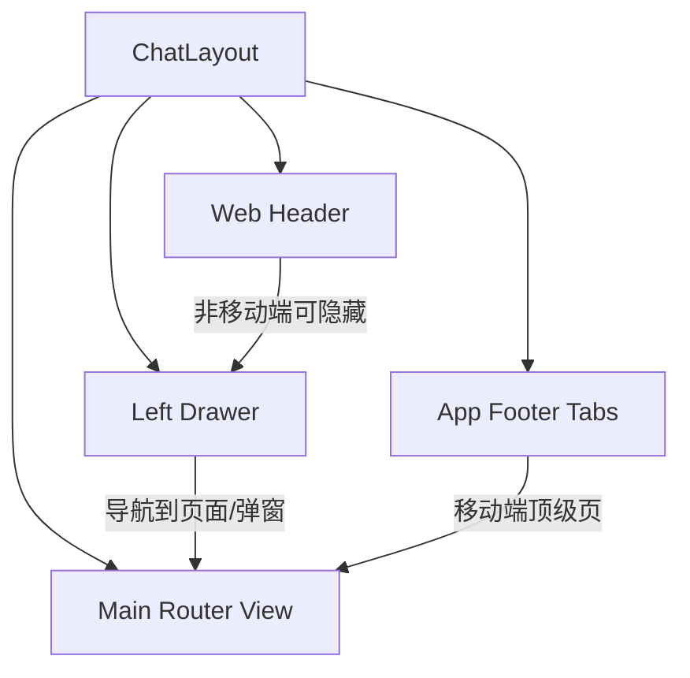

# 界面参考迁移说明（Quasar -> Nuxt UI 4）

## 1. 总体分析

目标是“参考其界面组织和交互方式”，而不是逐像素复刻 Quasar 组件细节。可迁移的核心是：

1. 页面/弹窗的信息分组方式。
2. 用户操作路径（入口在哪里、点击后去哪）。
3. 交互反馈节奏（立即生效、确认二次确认、错误定位）。
4. 移动端与非移动端的布局切换策略。

本项目中，这些能力主要由以下文件承载：

- `src/layouts/ChatLayout.vue`：主布局、移动端/非移动端切换、抽屉/底部导航。
- `src/layouts/AuthLayout.vue` + `src/views/auth/Login.vue`：本地账号登录。
- `src/coms/SettingsDlg.vue`：设置弹窗（选择即生效）。
- `src/coms/UserInfoDlg.vue` + `src/coms/UserBaseInfo.vue` + `src/coms/UserAvatar.vue`：用户信息展示。
- `src/coms/ChangePasswordDlg.vue`：修改密码弹窗。
- `src/views/Home.vue`（路由 `/about`）：关于我们。
- `src/views/BotList.vue`：管理机器人列表组织方式。

Nuxt UI 4 迁移建议：优先保持“容器层级 + 交互时序”，组件替换为 `UModal/UCard/UForm/UInput/USelect/UTabs/UButton/UAvatar/UDropdown` 等即可。

---

## 2. Layout（移动端 + 非移动端）

### 2.1 结构分层



关键点：同一套页面内容，按终端状态在“顶部栏 + 抽屉”与“底部 Tab”之间切换入口。

### 2.2 非移动端（Web 模式）

1. 左侧 `Drawer` 是主导航承载区：
- 顶部有“新的对话”按钮与抽屉开关。
- 中部是对话列表。
- 底部是用户菜单入口（头像 + 下拉菜单）。

2. Header 与 Drawer 的关系：
- 当 Drawer 占据布局时，可不显示 Header。
- 当 Drawer 变为浮层（或被收起）时，显示 Header，Header 左侧按钮用于开关 Drawer。

### 2.3 移动端（App 模式）

1. 底部固定三主导航：`对话 / 机器人 / 我的`。
2. 顶部 Header 在部分状态出现（例如 WebHeader 开启时），用于“打开抽屉”和“新建对话”。
3. 抽屉更多表现为覆盖层，点击操作后主动收起。

### 2.4 交互规则（迁移时应保留）

1. 导航入口统一：无论在用户页、关于页还是抽屉，触发后的页面行为应一致。
2. 抽屉状态联动：移动端操作后应主动关闭抽屉，避免遮挡。
3. 新建对话流程：点击“+ / 新的对话”后先选机器人，再进入该机器人的对话页。
4. 顶层页面切换保持轻量：主体内容区切换时避免重复嵌套布局。

### 2.5 Nuxt UI 4 对应建议

- 顶层：`app.vue` + `layouts/default.vue`。
- Header：`UButton + UIcon`。
- Drawer：`USlideover`（移动端）+ 侧栏固定容器（桌面端）。
- Footer Tabs：`UTabs` 或自定义 `UButton` 导航条。
- 页面容器：保持“一个主容器 + 动态内容区 + 全局弹窗入口”。

---

## 3. Settings（设置界面，选择后立即生效）

### 3.1 信息组织

`SettingsDlg` 是单个弹窗，分组按“偏好 -> 账号安全 -> 数据清理”：

1. 外观（主题）
2. 昵称（行内编辑）
3. 登录密码（私有版）
4. 清空机器人/清空对话（危险操作）
5. 数据加密方式（当前仅服务端可选，客户端加密提示建设中）

### 3.2 关键交互（本次迁移必须保留）

1. 无“保存设置”总按钮。
2. 每项独立即时提交：
- 切换主题：`onThemeChange` 立即请求更新。
- 昵称修改：点击勾选即提交；失焦结束编辑。
- 单选项变化：`@update:model-value` 即执行处理。

3. 危险操作二次确认：
- 清空机器人/清空对话均有确认文案 + 明确后果确认项。
- 确认后显示 loading，再给成功/失败反馈。

### 3.3 推荐交互伪代码（行为导向）

```ts
onSettingChange(key, value) {
  setLocalPending(key, true)
  try {
    await persistSetting(key, value)
    syncUiState(key, value)
  } finally {
    setLocalPending(key, false)
  }
}
```

### 3.4 Nuxt UI 4 落地建议

1. 容器：`UModal`。
2. 行项布局：`div + justify-between`。
3. 即时选择：`USelect/URadioGroup` 监听 `update:model-value`。
4. 行内编辑：`UInput + UButton(icon)` 控制编辑态。
5. 危险操作：`UModal` 二次确认或 `useOverlay` 打开确认框。

---

## 4. 用户信息展示（对话框 + 关于我们页面）

### 4.1 用户信息对话框（UserInfoDlg）

结构顺序：

1. 标题栏：`用户信息`。
2. 用户头像区：可编辑头像（上传/移除）。
3. VIP/等级标签（有则显示）。
4. 基础信息网格（`UserBaseInfo`）：
- 昵称（支持行内编辑）
- 登录名（可复制）或用户ID
- 登录方式
- 私有版：最近登录日期
- 公有版：累计消费、累计充值、余额

可迁移重点：信息按“身份信息 -> 账号信息 -> 统计信息”分组，避免一屏全量堆叠。

### 4.2 关于我们中的用户信息展示

`/about` 页在用户已登录时，使用折叠区块“您已登录”展示 `UserBaseInfo`，和对话框中的字段体系保持一致。

迁移建议：

1. 对话框展示“可编辑 + 全字段”。
2. 关于页展示“轻量摘要 + 可折叠”。
3. 两处复用同一 `UserBaseInfo` 组件，保持字段定义统一。

### 4.3 结构示意（字符图）

```text
[用户信息弹窗]
  [Avatar 可编辑]
  [VIP]
  [基础信息 Grid]
    昵称 | 值(可编辑)
    登录名 | 值(可复制)
    登录方式 | 值
    ...统计字段

[关于我们页面]
  [欢迎文案]
  [您已登录(折叠面板)]
    -> [同一个基础信息 Grid]
```

---

## 5. 本地账号登录界面

路由入口：`/account/login`，包裹在 `AuthLayout`（带背景图）中。

### 5.1 界面组织

1. 页面垂直居中卡片。
2. 表单字段：账号、密码（可切换明文）。
3. 提交按钮：登录。

### 5.2 交互规则

1. 前端必填校验。
2. 服务端错误映射到字段级：
- `InvalidLoginId` -> 账号框错误并聚焦。
- `InvalidPassword` -> 密码框错误并聚焦。
3. 登录成功后跳转到目标页面（通常是登录前页面或首页），避免回到无效登录态页面。

### 5.3 Nuxt UI 4 建议

- `UCard + UForm + UFormField + UInput`。
- 密码显示切换用 `trailing` 图标按钮。
- 错误码映射到 `error` 文案，不用只弹 toast。

---

## 6. 本地账号密码修改界面

入口在设置弹窗中“登录密码 -> 修改”，以二级弹窗打开。

### 6.1 表单组织

1. 当前密码
2. 新密码
3. 确认新密码
4. 提交按钮

### 6.2 规则与反馈

1. 前端规则：
- 新密码长度 >= 6
- 新旧密码不能相同
- 两次输入一致

2. 服务端错误定位：
- `InvalidOldPassword` 聚焦当前密码。
- `InvalidNewPassword` 聚焦新密码。

3. 成功后提示并关闭弹窗。

可迁移重点：这不是“设置总保存”，而是独立事务型弹窗，提交即完成。

---

## 7. 关于我们页面（/about）

页面组件：`Home.vue`，路由名 `Home`，标题“关于我们”。

### 7.1 页面组织

1. 顶部：页面头。
2. 说明文案：欢迎词/产品简介。
3. 登录提示（未登录时）。
4. 折叠面板群：
- 您已登录（登录后显示）
- 操作指引
- 基本概念
- 计费方式（公有版）
- 本地部署解决方案（公有版）

5. 底部 CTA 按钮区：
- 未登录：立即登录
- 已登录：与AI对话
- 已登录（公有）：推荐给好友

### 7.2 交互特点

1. 页面中的文本链接除了可做普通跳转，也可触发界面动作（如打开抽屉、打开绑定流程、打开设置、触发登录）。
2. 关键要求是：同一动作在不同入口触发时，用户看到的结果一致。

---

## 8. 管理机器人列表方式（仅用户机器人，通过绑定 OpenClaw 实例添加）

`BotList.vue` 当前有 tag tabs 和“创建机器人”入口；新项目按你的最新约束应调整为：

1. 仅展示当前用户自己的机器人。
2. 无系统机器人。
3. 无“创建机器人”item。
4. 机器人通过“绑定 OpenClaw 实例”来添加。
5. 无分类 tabs，使用单列表。

### 8.1 要保留的列表组织（调整后）

1. 列表顶部提供主操作按钮：`绑定 OpenClaw 实例`（非列表 item 形式）。
2. 机器人 item 列表每行包含：
- 头像
- 名称
- 摘要描述（2行截断）
- 对话使用量
- 操作按钮（编辑、更多菜单）

3. 更多菜单项：
- 分享机器人
- 停止分享（条件显示）
- 删除机器人

### 8.2 行为

1. 点击 item 主体：进入“以该机器人创建新对话”。
2. 点击编辑按钮：进入机器人编辑页。
3. 点击“绑定 OpenClaw 实例”：进入绑定流程，绑定成功后列表新增对应机器人。

### 8.3 移动端/桌面端差异

1. 移动端：使用量与摘要更紧凑，操作区缩短。
2. 桌面端：可显示独立“对话数”列，操作按钮右对齐。

### 8.4 无 tabs 版本结构建议（伪代码）

```vue
<BotListPage>
  <div class="toolbar">
    <UButton @click="goBindOpenClaw">绑定 OpenClaw 实例</UButton>
  </div>
  <List>
    <BotItem
      v-for="bot in bots"
      :key="bot.id"
      @click="goTopic(bot.id)"
      @edit="goEdit(bot.id)"
      @share="share(bot.id)"
      @unshare="unshare(bot.id)"
      @delete="remove(bot.id)"
    />
  </List>
</BotListPage>
```

---

## 9. 给 Nuxt UI 4 的统一落地约束

1. 以“页面 + 弹窗 + 行项”三级结构复用组件。
2. 设置类项默认“选择即生效”，避免总保存按钮。
3. 错误优先字段内提示，其次全局 toast。
4. 危险操作必须二次确认 + 加载态 + 成功反馈。
5. 同一份用户基础信息组件在多个容器复用（关于页、用户信息弹窗）。

